# 🎓 AWS Certified Cloud Practitioner (CLF-C02) — The Complete Study Guide for a Java Full-Stack Developer

> **This is the single, merged, definitive version of this study guide** (consolidated from two drafts by an AWS Solutions Architect review — the redundant companion file `AWS_Cloud_Complete_guide.md` now just points here). Every AWS concept is mapped to something you already know as a Java/Spring/full-stack developer, backed by Mermaid flow diagrams for hands-on/architectural recap, real company examples, interview Q&A, and exam-domain-weighted study guidance.

> **How to use this guide:** Read the "🧠 Real-World Analogy" first — that's the thing you'll actually remember in the exam room. Then the "📌 Exam Facts" nail the multiple-choice traps. The **Mermaid diagrams** (```mermaid code blocks) render automatically on GitHub, IntelliJ/WebStorm Markdown preview, and most modern Markdown viewers — use them for a 60-second visual recap before the exam.

---

## Table of Contents
1. [Section 1-2: Introduction](#section-1-2-introduction)
2. [Section 3: What is Cloud Computing?](#section-3-what-is-cloud-computing)
3. [Section 4: IAM — Identity and Access Management](#section-4-iam--identity-and-access-management)
4. [Section 5: EC2 — Elastic Compute Cloud](#section-5-ec2--elastic-compute-cloud)
5. [Section 6: EC2 Instance Storage](#section-6-ec2-instance-storage)
6. [Section 7: ELB & ASG](#section-7-elb--asg)
7. [Section 8: Amazon S3](#section-8-amazon-s3)
8. [Section 9: Databases & Analytics](#section-9-databases--analytics)
9. [Section 10: Other Compute Services](#section-10-other-compute-services-ecs-lambda-batch-lightsail)
10. [Section 11: Deployments & IaC](#section-11-deployments--managing-infrastructure-at-scale)
11. [Section 12: Global Infrastructure](#section-12-leveraging-the-aws-global-infrastructure)
12. [Section 13: Cloud Integration](#section-13-cloud-integrations)
13. [Section 14: Cloud Monitoring](#section-14-cloud-monitoring)
14. [Section 15: VPC & Networking](#section-15-vpc--networking)
15. [Section 16: Security & Compliance](#section-16-security--compliance)
16. [Section 17: Machine Learning](#section-17-machine-learning)
17. [Section 18: Account Management, Billing & Support](#section-18-account-management-billing--support)
18. [Section 19: Advanced Identity](#section-19-advanced-identity)
19. [Section 20: Other Services](#section-20-other-services)
20. [Section 21: AWS Architecting & Well-Architected Framework](#section-21-aws-architecting--ecosystem)
21. [Section 22-23: Exam Prep & Cheat Sheet](#section-22-23-exam-prep--final-cheat-sheet)
22. [🗺️ The Big Picture: A Full 3-Tier App on AWS](#the-big-picture-a-full-3-tier-app-on-aws)
23. [🏢 Real Company Examples (Who Uses What)](#-real-company-examples-who-uses-what)
24. [💬 Top Interview Questions & Answers](#-top-interview-questions--answers)
25. [🧩 Memory Mnemonics Vault](#-memory-mnemonics-vault)
26. [📝 20 Practice Exam Questions (with Answers)](#-20-practice-exam-questions-with-answers)

---

## 🗺️ The Big Picture: A Full 3-Tier App on AWS

Before diving section by section, look at this **one diagram** — it's basically 70% of the exam's "Technology" domain glued together. It's the same 3-tier architecture you already build with Spring MVC/React + MySQL, just redrawn with AWS building blocks.

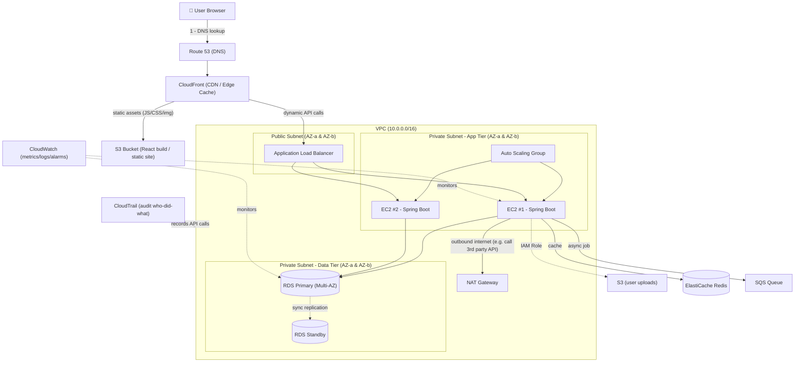

🧠 **How to read this forever:** *Route 53 finds the address → CloudFront caches what it can at the edge → ALB spreads dynamic traffic across your app servers in a private subnet → app servers talk to a Multi-AZ database and cache → everything is watched by CloudWatch and audited by CloudTrail.* If you can redraw this from memory, you already understand ~40% of the CLF-C02 exam.

---

## Section 1-2: Introduction

**What it covers:** Creating an AWS account, billing setup, root user warnings, console tour.

🧠 **Analogy:** Creating an AWS account is like creating a **root/admin DB user** in MySQL — you get it once during setup, it has god-mode privileges, and best practice (just like `root`) is: **use it once to create other users, then lock it in a drawer** (enable MFA, don't use it daily).

📌 **Exam Facts:**
- Never use the **root account** for daily work — create an IAM admin user instead.
- Always enable **MFA** on the root account.
- You need a valid **credit card + phone verification** to sign up.

---

## Section 3: What is Cloud Computing?

### Traditional IT vs Cloud
🧠 **Analogy:** Traditional IT = buying and maintaining your own Tomcat server in a rack at the office (you patch the OS, replace failed disks, buy more RAM when traffic grows). Cloud = renting the same capability from AWS like renting a hotel room instead of building a house — pay only for the nights you use it.

### Types of Cloud Computing
| Model | Java Dev Equivalent | Who manages what |
|---|---|---|
| **IaaS** (e.g. EC2) | You get a VM, you install Java, Tomcat, deploy your WAR | You manage OS + app |
| **PaaS** (e.g. Elastic Beanstalk) | Like Heroku/Spring Boot Cloud Foundry — you just push your JAR | AWS manages OS/runtime |
| **SaaS** (e.g. Gmail, Salesforce) | Like using Jira instead of building a ticketing system | AWS manages everything |

### Cloud Deployment Models
- **Public Cloud**: everything on AWS (like using a public Maven Central repo).
- **Private Cloud**: on-premise cloud-like infra (like your company's internal Nexus repo).
- **Hybrid**: mix of both (some services on-prem via VPN/Direct Connect, some on AWS).

### 6 Advantages of Cloud Computing
1. Trade capital expense for variable expense (pay-as-you-go — like AWS Lambda billing per invocation instead of buying a server).
2. Benefit from massive economies of scale.
3. Stop guessing capacity — **Auto Scaling** (like a Kubernetes HPA scaling your pods).
4. Increase speed and agility (spin up an EC2 in seconds vs weeks of procurement).
5. Stop spending money running data centers.
6. Go global in minutes (deploy to multiple **Regions**).

### AWS Global Infrastructure
🧠 **Analogy:**
- **Region** = a country/city (e.g., `us-east-1` = North Virginia). Think of it as a Maven repository mirror — pick the one closest to your users for lower latency.
- **Availability Zone (AZ)** = a data center (or group of them) within a region, isolated from failures in another AZ, but connected via low-latency links. Like deploying your Spring Boot app on 3 separate physical servers in different buildings so one power outage doesn't kill your app — this is why you always deploy EC2/RDS across **at least 2 AZs** for high availability.
- **Edge Locations** = CDN caching points (CloudFront) — like a static asset CDN (jsDelivr/Cloudflare) close to your users.

### Shared Responsibility Model
🧠 **Analogy:** Like renting an apartment. The landlord (**AWS**) is responsible for the building's foundation, electricity, plumbing (physical security, hardware, global network, host OS on managed services). **You (the tenant)** are responsible for locking your own door, not leaving windows open (data encryption, IAM permissions, security group rules, patching your own EC2 OS, application-level security).
- **AWS manages:** Security **OF** the cloud (hardware, physical security, global infra).
- **You manage:** Security **IN** the cloud (data, IAM, OS/patches on EC2, network config, firewall rules — like configuring `application.yml` and Spring Security correctly).

---

## Section 4: IAM — Identity and Access Management

🧠 **Analogy:** IAM is basically **Spring Security for your entire AWS account.**

| IAM Concept | Spring Security Equivalent |
|---|---|
| **IAM User** | A `UserDetails` object — one identity, one set of credentials |
| **IAM Group** | A `Role` — bundles permissions for a set of users (e.g., "Developers" group) |
| **IAM Policy** (JSON) | Your `@PreAuthorize("hasRole('ADMIN')")` rules, but declarative in JSON |
| **IAM Role** | A temporary/impersonated identity — like an OAuth2 access token an EC2 instance "wears" to call other AWS services without hardcoding credentials |
| **MFA** | 2FA on top of username/password |

### IAM Policies
A policy is JSON — Effect (Allow/Deny), Action (e.g., `s3:GetObject`), Resource (ARN), Condition.
```json
{
  "Version": "2012-10-17",
  "Statement": [{
    "Effect": "Allow",
    "Action": "s3:GetObject",
    "Resource": "arn:aws:s3:::my-bucket/*"
  }]
}
```
📌 **Exam Fact:** **Explicit Deny always wins** — just like a `@PreAuthorize` denial short-circuits everything else. Least privilege principle = only grant what's needed (same as not making every Spring bean `public`).

### 🔍 Deep Dive: How IAM Actually Decides "Allow or Deny?" (memorize this flow)
This is the **#1 most-tested IAM concept**. Every single API call goes through this exact evaluation logic — think of it like a `SecurityFilterChain` that runs on every request:

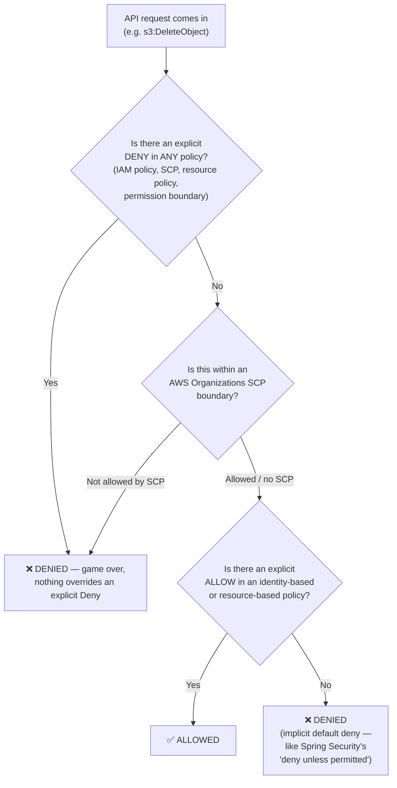

🧠 **Analogy:** Same mental model as a firewall/ACL chain: **Deny rules are like `throw new AccessDeniedException()`** — they short-circuit immediately. Everything is **implicitly denied by default** (like a locked-down `@Secured` app where you must explicitly whitelist each endpoint) — an absence of an Allow is just as good as a Deny.

### IAM MFA
Extra layer: virtual MFA device (Google Authenticator), U2F key, hardware key.

### 🔍 Missing but Important: Permission Boundaries & IMDSv2
- **Permission Boundary**: an advanced IAM feature that sets the **maximum permissions** a user/role can ever have, even if their attached policy grants more — like a `<security-constraint>` ceiling in `web.xml` that no controller can exceed, no matter what `@PreAuthorize` says. Useful when letting junior devs create their own IAM roles safely (they can create roles, but can never grant more than the boundary allows).
- **IMDS (Instance Metadata Service)**: a special local endpoint (`http://169.254.169.254`) every EC2 instance can query to fetch its own IAM Role's temporary credentials — this is literally **how** your Java AWS SDK code running on EC2 automatically "just works" without you configuring any access keys.
    - **IMDSv1** (old, insecure): a simple GET request — vulnerable to SSRF attacks (a hacker who tricks your app into making an arbitrary HTTP request could steal your instance's credentials).
    - **IMDSv2** (current best practice): requires a **session token** (PUT request first, then GET with that token) — like requiring a CSRF token before a state-changing request. **Always enable IMDSv2-only mode on new EC2 instances.**

### AWS CLI, SDK & Access Keys
🧠 **Analogy:** Access Key ID + Secret Access Key = like a `username:password` pair used by your Java app's AWS SDK client (`software.amazon.awssdk`) to authenticate — same concept as putting DB credentials in `application.properties`, except **you should NEVER hardcode these** (use IAM Roles instead, just like you'd use environment variables/Vault instead of hardcoding a DB password).
- **CLI** = command line tool (`aws s3 ls`) — like using `curl` to test your REST API.
- **SDK** = the Java library you `import` (e.g., AWS SDK for Java) to call AWS services programmatically — like using `RestTemplate`/`WebClient` to call a third-party API.

### IAM Roles
🧠 **Analogy:** Instead of hardcoding a "password" into your EC2 instance, you attach an **IAM Role** to it — exactly like using a **Kubernetes ServiceAccount** or a short-lived JWT token that's automatically rotated. Common roles: EC2 Role, Lambda Role, CloudFormation Role.

### IAM Security Tools
- **IAM Credentials Report**: account-level report (like a `mvn dependency:tree` but for all users' credentials/keys).
- **IAM Access Advisor**: shows service permissions granted vs. last used (like finding unused `@Autowired` beans — helps you prune permissions).

### IAM Best Practices
- Don't use root, enable MFA, apply least privilege, use IAM roles for EC2/Lambda instead of access keys, rotate credentials regularly.

📌 **Shared Responsibility for IAM:** AWS secures the IAM infrastructure; you manage users, groups, policies, and rotating your own keys.

---

## Section 5: EC2 — Elastic Compute Cloud

🧠 **Analogy:** **EC2 = a virtual machine you rent**, exactly like spinning up a VirtualBox/VMware VM on your laptop to run Tomcat — except AWS hosts it, and you can resize (vertical scaling) or spin up more copies (horizontal scaling) in seconds.

### EC2 Sizing & Configuration Options
- OS choice (Linux/Windows/Mac), compute power (vCPU), memory (RAM), storage, network card, **EC2 User Data** = a boot script (like a `Dockerfile`'s `CMD`/`ENTRYPOINT` — runs once at first boot, e.g., to `yum install java` and start your Spring Boot app automatically).

### EC2 Instance Types
🧠 **Analogy:** Just like choosing a Docker container's resource limits:
- **General Purpose (t3, m5)**: balanced — like a typical Spring Boot microservice.
- **Compute Optimized (c5)**: CPU-heavy — like a batch job doing heavy JSON parsing/encryption.
- **Memory Optimized (r5)**: for in-memory caches — like running a large Redis/Ehcache instance.
- **Storage Optimized (i3)**: for high IOPS DBs — like a Cassandra/Elasticsearch node.

### Security Groups
🧠 **Analogy:** A **Security Group = a stateful firewall**, exactly like a Spring Security `HttpSecurity` config that says "only allow port 8080 inbound from this IP range." It's **attached to the instance** (not the subnet).
📌 **Exam Facts:**
- Security Groups are **stateful**: if you allow inbound traffic, the response is automatically allowed out (like a `try/finally` — the return path is automatic).
- All inbound traffic is **blocked by default**; all outbound traffic is **allowed by default**.
- Can reference other Security Groups (e.g., "allow traffic from the App-SG" — like allowing calls only from your API Gateway's IP).
- **Timeout errors** = usually a Security Group issue. **Connection refused** = application not running/wrong port.

### SSH & EC2 Instance Connect
Connecting to your EC2 = like SSH-ing into a remote dev server to `tail -f` your Spring Boot logs. **EC2 Instance Connect** = browser-based SSH (no need to manage a `.pem` key file, like using a web-based terminal in IntelliJ's SSH plugin).

### EC2 Instance Roles
An IAM Role attached to the EC2, so code running on it (e.g., your Java app using AWS SDK) can call S3/DynamoDB **without embedding credentials** — exactly like using a Spring `@ConfigurationProperties` bean that gets injected via environment, not hardcoded.

### 🔍 Deep Dive: EC2 Instance Lifecycle (a hands-on topic — recap with this diagram)
Every time you "start", "stop", "reboot", or "terminate" an instance in the console (the hands-on labs), this is what's actually happening underneath:

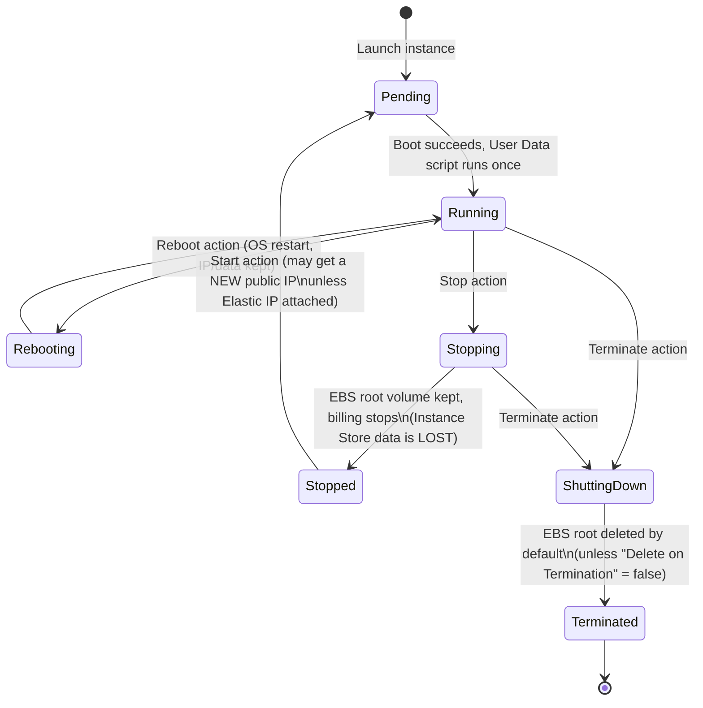

📌 **Exam Fact:** `Stop`/`Start` ≠ `Reboot`. A **Stop/Start** can move your instance to different underlying hardware and gives you a **new public IP** (unless you use an Elastic IP). A **Reboot** keeps the same host and IP. **Terminate** is irreversible — the instance disappears forever.

### 🔍 Missing but Important: Elastic IP, Placement Groups & Bastion Hosts
- **Elastic IP**: a **static public IPv4 address** you own and can re-attach to any instance — like reserving a fixed IP for your on-call server instead of getting a random one every restart (exam tip: AWS *discourages* overuse of Elastic IPs — they charge you when it's **not** attached to a running instance, nudging you toward using a Load Balancer's DNS name instead, which is the real best practice).
- **Placement Groups**: control *how* AWS physically places your instances relative to each other:
    - **Cluster**: pack instances close together in one AZ for lowest network latency — like colocating microservices on the same rack for a high-frequency trading app.
    - **Spread**: keep each instance on **different** hardware racks — for a small number of critical instances that must never fail together (like your primary + backup DB nodes).
    - **Partition**: groups of instances spread across logical partitions — used by big distributed systems (Kafka, Cassandra, HDFS) to limit how many nodes one hardware failure can take down.
- **Bastion Host** (a.k.a. jump box): a small EC2 in the **public subnet** that's the *only* server allowed SSH access; from there you hop into your **private subnet** EC2 instances — like a VPN gateway/jump server your ops team already uses to reach production DB servers that aren't directly internet-facing. (In modern AWS, **SSM Session Manager** — covered in Section 11 — is the preferred replacement since it needs no open SSH port at all.)

### EC2 Purchasing Options
| Option | Analogy |
|---|---|
| **On-Demand** | Pay-per-use, like an hourly Airbnb — no commitment, most expensive per hour |
| **Reserved Instances (1 or 3 yr)** | Annual gym membership — commit long-term, big discount |
| **Savings Plans** | Like a phone data plan — commit to $/hour spend, flexible instance family |
| **Spot Instances** | Buying last-minute flight tickets super cheap, but you can be "bumped" (interrupted) — great for **stateless batch jobs**, terrible for your production DB |
| **Dedicated Hosts/Instances** | Renting the entire physical server — for strict compliance (e.g., licensing tied to physical cores) |

📌 **Shared Responsibility for EC2:** AWS manages the physical hardware/hypervisor; **you** manage the guest OS patches, security groups, IAM, and data.

---

## Section 6: EC2 Instance Storage

🧠 **Analogy:** Think of this like choosing between your laptop's **internal SSD** vs. an **external USB drive** vs. a **NAS**.

- **EBS (Elastic Block Store)** = a network-attached virtual hard drive (like an external SSD you can unplug from one laptop and plug into another). **Persists** independently of the instance's life. One EBS volume can only attach to one EC2 at a time (unless Multi-Attach, io-series only).
- **EBS Snapshots** = a backup of your EBS volume at a point in time — exactly like a `git commit` for your disk, or a DB backup/dump. Stored in S3 behind the scenes.
- **EBS Multi-Attach**: multiple EC2 instances can attach to the same EBS volume — like a shared network drive multiple servers write to (needs a cluster-aware file system).
- **Instance Store** = physical disk **directly attached** to the host — super fast (like an internal NVMe SSD), but **ephemeral**: data is **lost** when the instance stops/terminates (like an in-memory `HashMap` cache — great for temp/cache data, bad for anything you need to keep).
- **EFS (Elastic File System)** = a network file system that **multiple EC2 instances share simultaneously** — like a shared network drive (`\\fileserver\shared`) mounted by many servers — perfect for a fleet of web servers needing the same uploaded files.
- **FSx** = managed third-party file systems (FSx for Windows = SMB shares, FSx for Lustre = high-performance computing).

### 🔍 Deep Dive: Which Storage Attaches to What? (recap diagram)
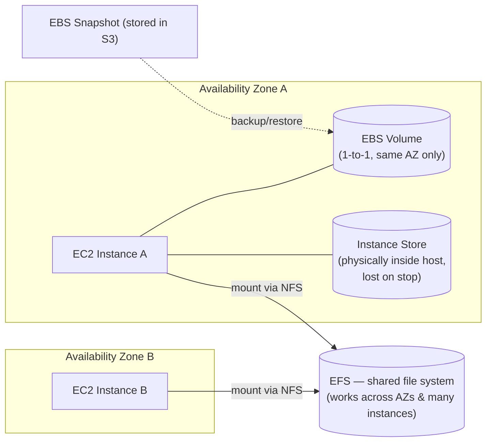

🧠 **Key takeaway to remember forever:** EBS = "one laptop, one external SSD" (same AZ only, one instance at a time normally). EFS = "shared network drive the whole office (multiple AZs) can open at once." Instance Store = "the RAM stick — blazing fast but forget everything on power-off."

📌 **Exam Fact:** Root volume of an instance store-backed AMI is **lost on stop**; EBS-backed root volumes **persist** by default on stop (you only lose data on **terminate**, unless you set "Delete on Termination" = false).

---

## Section 7: ELB & ASG

🧠 **Analogy:** This whole section = **a load balancer + Kubernetes Horizontal Pod Autoscaler**, but managed.

### High Availability, Scalability, Elasticity
- **Scalability** = ability to grow (vertical: bigger EC2 = upgrading your laptop RAM; horizontal: more EC2s = adding more team members to split the work).
- **Elasticity** = auto-adjusts to demand (scale out on Black Friday, scale in at 3 AM) — like Kubernetes HPA reacting to CPU metrics.
- **High Availability** = survives failures by running across multiple AZs — like deploying your microservice replicas across multiple data centers so one region outage doesn't take you down.

### Elastic Load Balancing (ELB)
🧠 **Analogy:** Exactly like an **Nginx reverse proxy / API Gateway** in front of your Spring Boot instances, distributing traffic and doing health checks (`/actuator/health`).
- **ALB (Application Load Balancer)**: Layer 7 (HTTP/HTTPS) — can route based on URL path (`/api/users` → user-service, `/api/orders` → order-service), exactly like Spring Cloud Gateway routes.
- **NLB (Network Load Balancer)**: Layer 4 (TCP/UDP), ultra-low latency, for extreme performance needs.
- **GWLB**: for third-party network appliances (firewalls).

### Auto Scaling Groups (ASG)
🧠 **Analogy:** Literally a Kubernetes Deployment with `minReplicas`/`maxReplicas`/`desiredReplicas` and a metrics-based HPA:
- **Min/Max/Desired capacity**.
- **Scaling policies**: Target Tracking (like HPA targeting 70% CPU), Step Scaling, Scheduled Scaling (scale up before a big traffic event, like a Black Friday sale — set a cron-like scheduled action).
- Uses a **Launch Template** (like a Dockerfile/pod spec — defines AMI, instance type, security group, user data for every new instance).

### 🔍 Deep Dive: The Full Scaling Loop (hands-on recap diagram)
This is exactly what happens during the "Auto Scaling Groups Hands On" lab when you stress-test your instances:

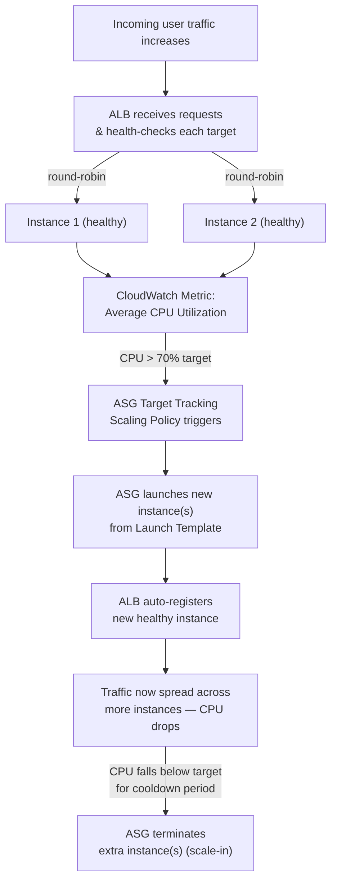

📌 **Exam Fact:** ASG works hand-in-hand with ELB — the ELB registers/deregisters instances as the ASG scales in/out, and only routes to instances passing **health checks**. If health check fails, ASG will terminate and replace that instance automatically (self-healing — like a Kubernetes liveness probe restarting a crashed pod).

---

## Section 8: Amazon S3

🧠 **Analogy:** S3 = **an infinitely scalable, durable file storage / static file server**, like storing files in a cloud version of your `src/main/resources/static` folder or an object store (MinIO) — but instead of a file system path, you use a `key` (like a Map key) inside a `bucket` (like a top-level folder/namespace).

### Core Concepts
- **Bucket**: globally unique name (like a Maven `groupId` — must be unique worldwide).
- **Object**: file + metadata, up to 5TB, identified by a **key** (its "path").
- 11 nines (99.999999999%) durability — basically "your file will never be lost."

### S3 Security: Bucket Policy
🧠 **Analogy:** Like an IAM policy, but attached to the bucket itself, not a user — like a Spring Security `WebSecurityConfigurerAdapter` rule specific to one URL path (`/public/**`) rather than a specific user role.
```json
{
  "Effect": "Allow",
  "Principal": "*",
  "Action": "s3:GetObject",
  "Resource": "arn:aws:s3:::my-bucket/*"
}
```

### S3 Website Hosting
You can host a static website (HTML/CSS/JS/React build) directly from a bucket — like deploying your React frontend's `build/` folder to Netlify, except it's S3.

### S3 Versioning
🧠 **Analogy:** Like **`git` version history for your files** — every overwrite creates a new version, and you can roll back. Must be enabled at the bucket level.

### S3 Replication (CRR/SRR)
Cross-Region or Same-Region Replication — like a **database read replica**, but for files: automatically copy new objects to another bucket (different region for disaster recovery, or same region for aggregation). **Must enable versioning** on both buckets first.

### 🔍 Deep Dive: S3 Upload + Versioning + Replication (hands-on recap diagram)
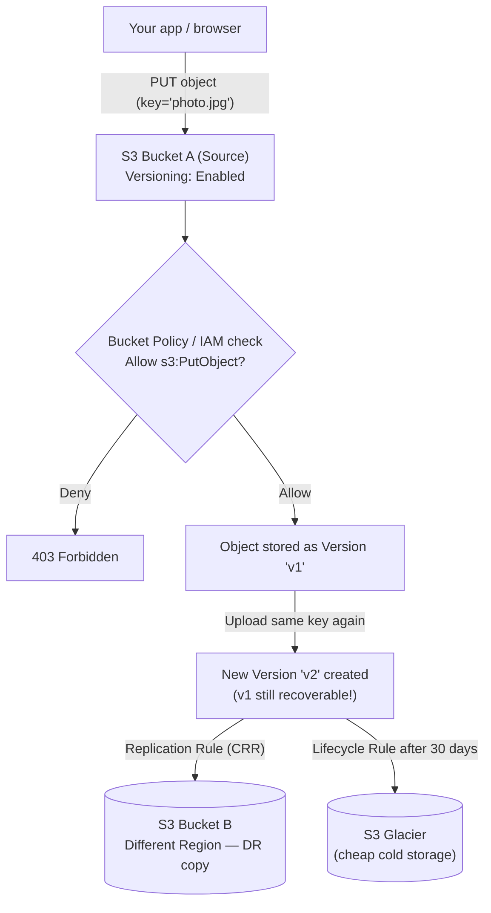

🧠 **Analogy:** This is identical to a `git push` (versioning = commit history), a cross-region DB replica (replication = DR copy), and a log-rotation cron job (lifecycle rule = auto-archive old files to cheaper storage).

### S3 Storage Classes
🧠 **Analogy:** Like choosing your logging retention strategy — hot logs stay fast/accessible, old logs get archived to cold/cheap storage:
| Class | Analogy |
|---|---|
| **Standard** | Frequently accessed files — your active `git` repo |
| **Intelligent-Tiering** | Auto-moves files between hot/cold based on usage — like an auto-archiving cron job |
| **Standard-IA / One Zone-IA** | Infrequent access, cheaper storage, retrieval fee — like a backup drive you rarely plug in |
| **Glacier Instant/Flexible/Deep Archive** | Cold archival storage, mins-to-hours retrieval — like backup tapes in a vault |
| **S3 Express One Zone** | Ultra-low latency, single AZ — for high-performance ML/analytics workloads |

### Other S3 Features
- **IAM Access Analyzer for S3**: finds buckets accidentally exposed to the public (like a linter that flags an `@CrossOrigin("*")` on a sensitive endpoint).
- **Snow Family (Snowball, Snowcone)**: physical devices AWS ships you to transfer **huge** amounts of data offline — like mailing a hard drive instead of trying to `scp` 100TB over a slow connection.
- **Storage Gateway**: bridges on-premise apps to S3 — like a caching proxy between your legacy on-prem NAS and the cloud.

📌 **Shared Responsibility for S3:** AWS manages durability/infrastructure; you manage bucket policies, versioning, replication config, and public access settings (a huge number of real-world data breaches = misconfigured public S3 buckets!).

---

## Section 9: Databases & Analytics

🧠 **Analogy:** This section is your **JPA/Hibernate world, but AWS-managed** (no more `apt-get install mysql-server` and patching it yourself).

### RDS & Aurora
- **RDS**: managed relational DB (MySQL, PostgreSQL, MariaDB, Oracle, SQL Server) — like using a managed MySQL instead of installing/patching your own; AWS handles backups, patching, failover.
- **Aurora**: AWS's own MySQL/PostgreSQL-compatible DB, faster & more resilient (like a "turbocharged" fork of MySQL) — auto-scaling storage, 6 copies of data across 3 AZs.
- **Read Replicas**: scale reads (like using a secondary DB connection pool for reporting queries so you don't slow down your main transactional DB — exactly like a JPA `@Transactional(readOnly=true)` datasource routed to a replica).
- **Multi-AZ**: for disaster recovery (synchronous standby copy, automatic failover) — like a hot standby.

### 🔍 Deep Dive: Multi-AZ vs. Read Replica (the #1 confused RDS topic)
Java developers mix these up constantly because both involve "another copy of the DB" — but they solve **opposite problems**: one is for **availability**, the other is for **read performance**.

```mermaid
flowchart TB
    subgraph MultiAZ["Multi-AZ = Disaster Recovery (High Availability)"]
        App1["Your Spring Boot App"] -->|"read + write"| Primary1[("Primary DB - AZ-a")]
        Primary1 -.."synchronous replication\n(always in lock-step)".-> Standby1[("Standby DB - AZ-b\n(NOT queryable directly!)")]
        Primary1 -.."🔥 fails".-> Fail["AWS auto-detects failure"]
        Fail -->|"DNS endpoint auto-flips"| Standby1
    end
    subgraph ReadReplica["Read Replica = Performance Scaling"]
        App2["Your Spring Boot App"] -->|"writes"| Primary2[("Primary DB")]
        App2 -->|"@Transactional(readOnly=true)\nreporting queries"| Replica2[("Read Replica\n(asynchronous, IS queryable)")]
        Primary2 -.."async replication (slight lag)".-> Replica2
    end
```

📌 **Exam Fact:** Multi-AZ standby is **invisible/unusable for reads** (it's purely a failover target — a hot spare). Read Replicas **are** usable for read queries and can even be promoted to a standalone primary DB, but replication is **asynchronous** so there can be replication lag (eventual consistency — like a Kafka consumer that's slightly behind the producer).

### 🔍 Missing but Important: RDS Proxy
🧠 **Analogy:** If you've ever configured **HikariCP** connection pooling in Spring Boot, this is the exact same idea but managed by AWS, sitting *between* your Lambda functions/app and RDS. **RDS Proxy** pools and multiplexes database connections so that a burst of Lambda invocations (which can each open their own DB connection) doesn't exhaust your database's max connection limit. Also enables faster failover during a Multi-AZ event since the app talks to the stable proxy endpoint instead of reconnecting directly.

### ElastiCache
🧠 **Analogy:** Managed **Redis or Memcached** — exactly like adding `@Cacheable` with a Redis backend to your Spring app instead of hitting the DB every time.

### DynamoDB
🧠 **Analogy:** A managed **NoSQL key-value/document store**, like using MongoDB but serverless — no schema, scales automatically, single-digit millisecond latency. Think of it like a giant distributed `HashMap<Key, JsonDocument>`.
- **DynamoDB Global Tables**: multi-region, active-active replication — like having your `HashMap` synced across data centers worldwide.

### Redshift
🧠 **Analogy:** A **data warehouse** for OLAP (analytics) — like running complex `GROUP BY`/aggregation reports on a separate DB so it doesn't slow down your production OLTP database. Uses columnar storage.

### Athena
Serverless SQL queries **directly on files in S3** — like running SQL on a CSV/Parquet file without loading it into a database first (pay-per-query).

### QuickSight
BI/dashboarding tool — like Tableau/PowerBI, but AWS-native, for visualizing your data.

### Other DBs (good enough to recognize on the exam)
- **DocumentDB**: managed MongoDB-compatible DB.
- **Neptune**: graph database (like Neo4j) — for relationship-heavy data (social networks, fraud detection).
- **Timestream**: time-series DB — for IoT sensor data / metrics.
- **Managed Blockchain**: managed blockchain networks.

📌 **Exam tip:** If the question says "relational" → RDS/Aurora. "Key-value/NoSQL, serverless, massive scale" → DynamoDB. "Analytics/data warehouse" → Redshift. "Cache" → ElastiCache. "Query files in S3" → Athena.

---

## Section 10: Other Compute Services (ECS, Lambda, Batch, Lightsail)

### Docker, ECS, Fargate, ECR
🧠 **Analogy:** You already know this world!
- **Docker** = same Docker you use locally to containerize your Spring Boot app.
- **ECS (Elastic Container Service)** = AWS's own container orchestrator, like a managed alternative to running your own Kubernetes cluster.
- **EKS (Elastic Kubernetes Service)** = **managed Kubernetes** — if your team already writes `Deployment`/`Service` YAML manifests, EKS is literally that, except AWS runs and patches the Kubernetes **control plane** (the `kube-apiserver`, etcd, scheduler) for you. You still manage worker nodes (or use Fargate for those too). Choose EKS over ECS when you need Kubernetes portability (e.g., avoiding vendor lock-in, or your team already has K8s expertise) — choose ECS when you want the *simplest* AWS-native container option with zero Kubernetes learning curve.
- **Fargate** = **serverless containers** — you don't manage the EC2 servers at all, just say "run this container" (like Google Cloud Run) — no more patching worker nodes. Works with **both** ECS and EKS.
- **ECR (Elastic Container Registry)** = AWS's private **Docker Hub** — where you `docker push`/`docker pull` your images, exactly like using a private Nexus/Artifactory Docker registry. Integrates natively with IAM (image push/pull permissions) and vulnerability scanning.

📌 **Exam tip:** "AWS-native, simplest container option" → ECS. "Need Kubernetes/multi-cloud portability" → EKS. "No server management for containers" → Fargate (works with either). "Store Docker images privately" → ECR.

### Lambda (Serverless)
🧠 **Analogy:** A **Lambda function = a single `@Bean` method that runs on-demand**, with **zero server management**. It's like writing one Java method, deploying just that method, and AWS runs it only when triggered (an HTTP call, an S3 upload, a scheduled cron) — you pay only for the milliseconds it actually executes. No idle server cost, unlike keeping a Tomcat instance running 24/7.
- Short-lived (max 15 min), stateless, auto-scales per request.
- Great for: image processing on S3 upload, glue code between services, lightweight APIs.

### 🔍 Deep Dive: How a Lambda Request Actually Flows (+ the "Cold Start" topic everyone asks about)
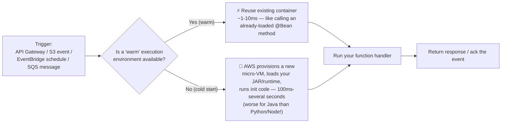
🧠 **Analogy:** A **cold start** is like the very first request after your Tomcat server just booted — the JVM/classes need to warm up (JIT compilation). A **warm** invocation is like a request that hits an already-running, already-JIT-optimized Spring Boot app — much faster. This is *exactly* why Lambda in Java tends to have higher cold-start latency than in Python/Node (JVM startup cost) — a very common exam/interview talking point.

📌 **Missing but Important:** **Concurrency** — Lambda automatically runs one execution environment **per concurrent request** (like auto-scaling instantly to N parallel "threads" with zero configuration). You can set **Reserved Concurrency** (guarantee/limit capacity for one function) or **Provisioned Concurrency** (keep N environments "pre-warmed" to eliminate cold starts for latency-sensitive APIs — like keeping a minimum pool of Tomcat threads always alive).

### API Gateway
🧠 **Analogy:** Like **Spring Cloud Gateway or Zuul** in front of your Lambda functions — handles routing, throttling, auth, and request/response transformation, turning Lambda functions into REST APIs.

### Batch
For batch computing jobs (like a big nightly Spring Batch job) — AWS Batch provisions the right compute resource automatically to run your batch jobs to completion.

### Lightsail
🧠 **Analogy:** The "**shared hosting**" of AWS — simplified VPS with a fixed monthly price, easy for beginners (like DigitalOcean droplets) — for simple web apps/blogs, not enterprise-scale workloads.

📌 **Exam tip:** "Serverless, event-driven, pay-per-execution" → Lambda. "Containers, need orchestration control" → ECS/EKS. "Containers, no server management" → Fargate. "Simple, cheap, all-in-one VPS" → Lightsail.

---

## Section 11: Deployments & Managing Infrastructure at Scale

🧠 **Analogy:** This whole section = **DevOps/CI-CD tooling**, AWS-flavored, similar to Jenkins/GitLab CI/Terraform/Ansible you may already use.

- **CloudFormation** = **Infrastructure as Code (IaC)**, like a Terraform template but AWS-native — you write a YAML/JSON template describing your infra (EC2, S3, RDS...) and AWS provisions it exactly, repeatably (like `docker-compose.yml`, but for your whole AWS account).
- **Elastic Beanstalk** = PaaS — you just upload your JAR/WAR, and AWS handles provisioning EC2, ELB, ASG, RDS underneath — exactly like deploying to Heroku instead of manually configuring servers.
- **CodeDeploy**: automates code deployments to EC2/on-prem/Lambda (like a deployment script that does rolling updates).
- **CodeCommit**: managed private Git repo (like GitHub/GitLab, hosted by AWS) — largely deprecated in favor of GitHub now, but still testable.
- **CodeBuild**: managed build service (compiles code, runs tests) — like a managed Jenkins build agent / GitHub Actions runner.
- **CodePipeline**: orchestrates the full CI/CD pipeline (source → build → deploy) — like a GitHub Actions/Jenkins pipeline connecting CodeCommit → CodeBuild → CodeDeploy.
- **CodeArtifact**: managed artifact repository — like a private Maven/npm repository (Nexus/Artifactory equivalent).
- **Systems Manager (SSM)**:
    - **Session Manager**: browser-based/CLI shell access to EC2 **without opening SSH port 22** (more secure than a bastion host).
    - **Parameter Store**: managed key-value config store — like Spring Cloud Config Server or a `.env` file, but centrally managed & encrypted (great for storing DB URLs, feature flags, secrets).

### 🔍 Deep Dive: The Full CI/CD Pipeline (recap diagram for a Java full-stack dev)
This is exactly the pipeline you'd build with Jenkins/GitHub Actions — just fully managed by AWS:

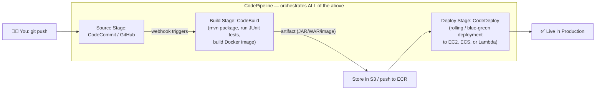

🧠 **Analogy:** `CodePipeline` = your `Jenkinsfile`/`.github/workflows/*.yml` — it's the **orchestrator**. `CodeBuild` = the **build agent/runner** that executes your `buildspec.yml` (equivalent to your `pom.xml` + test suite). `CodeDeploy` = the **deployment script** that pushes the built artifact out with zero/low downtime (rolling update, exactly like a Kubernetes rolling deployment).

📌 **Exam tip:** Think "**Source → Build → Deploy**" pipeline = CodeCommit/GitHub → CodeBuild → CodeDeploy, all orchestrated by CodePipeline.

---

## Section 12: Leveraging the AWS Global Infrastructure

### Route 53
🧠 **Analogy:** AWS's **managed DNS service** (like GoDaddy/Cloudflare DNS) — translates `myapp.com` → IP address. Also supports advanced routing policies:
- **Weighted**: A/B testing (send 90% traffic to v1, 10% to v2 — like a canary deployment).
- **Latency-based**: routes users to the region with lowest latency.
- **Failover**: routes to backup region if primary is down.
- **Geolocation**: routes based on user's location.

### CloudFront
🧠 **Analogy:** A **CDN**, like Cloudflare/Akamai — caches your static content (JS/CSS/images) at edge locations close to users, so your React/Angular frontend loads faster worldwide, reducing load on your origin server (S3/EC2/ALB).

### 🔍 Deep Dive: CloudFront Cache Hit vs. Miss (recap diagram)
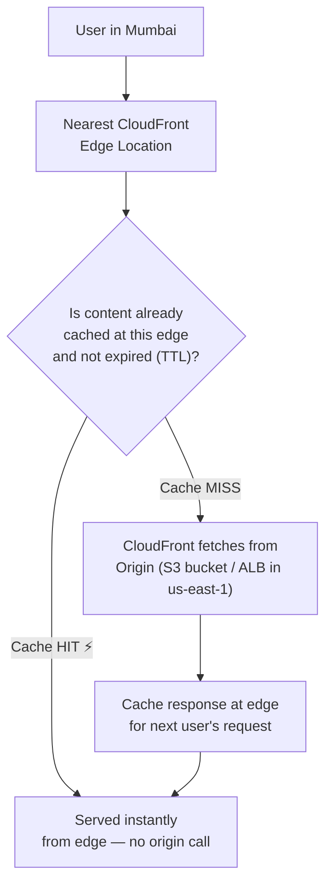
🧠 **Analogy:** Exactly like a **second-level Hibernate/Ehcache cache** — first request is a "miss" (hits the real DB/origin), subsequent requests are "hits" served instantly from cache until the TTL expires.

### S3 Transfer Acceleration & Global Accelerator
Speed up transfers over long distances by routing through AWS's private backbone network instead of the public internet — like using a private highway instead of public traffic-jammed roads.

### AWS Wavelength & Local Zones
Extend AWS infrastructure closer to end users (telco 5G networks / specific metro areas) for ultra-low-latency use cases (gaming, AR/VR).

📌 **Exam tip:** "Static content caching worldwide" → CloudFront. "DNS routing" → Route 53. "Speed up large file uploads to S3" → Transfer Acceleration.

---

## Section 13: Cloud Integrations

🧠 **Analogy:** This is AWS's version of **messaging/queueing systems** — if you've used **JMS, RabbitMQ, or Kafka**, this section is easy.

- **SQS (Simple Queue Service)** = a **message queue**, like JMS/RabbitMQ — decouples producers and consumers (e.g., order-service pushes a message, payment-service consumes it later). Point-to-point, messages deleted after processing.
- **SNS (Simple Notification Service)** = **pub/sub**, like a Kafka topic or an event bus — one message published, many subscribers receive it (e.g., email, SQS queues, Lambda functions all subscribed to "OrderPlaced" topic).
- **SNS + SQS "fan-out" pattern**: publish once to SNS, multiple SQS queues subscribe — like broadcasting one Kafka event to multiple consumer groups.
- **Kinesis**: real-time streaming data (like Kafka itself) — for ingesting/processing high-throughput data streams (clickstreams, IoT sensor data, log aggregation) in real time.
- **Amazon MQ**: managed **ActiveMQ/RabbitMQ** — for when you're migrating a legacy app that already uses JMS/AMQP protocols and don't want to rewrite it for SQS/SNS.

### 🔍 Deep Dive: SNS + SQS Fan-Out Pattern (hands-on recap diagram)
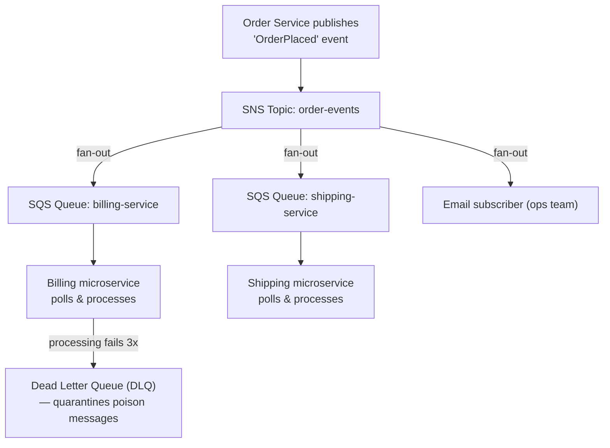

🧠 **Analogy:** This is identical to publishing **one Kafka event** that multiple **consumer groups** independently subscribe to — each service (billing, shipping) processes the same event at its own pace, fully decoupled from the order service.

📌 **Missing but Important Topics:**
- **Visibility Timeout**: when a consumer picks up an SQS message, it becomes "invisible" to other consumers for a set time (e.g., 30s) while being processed — like a database row lock (`SELECT ... FOR UPDATE`) preventing two workers from processing the same job twice. If the consumer doesn't delete the message in time (crash/slow processing), it **reappears** in the queue for another consumer to retry.
- **Dead Letter Queue (DLQ)**: after a message fails processing a configured number of times, it's automatically routed to a separate "DLQ" instead of being retried forever — like a `@Retryable(maxAttempts=3)` in Spring, after which the failed job goes to an error-log table for manual inspection instead of blocking the whole queue.

📌 **Exam tip:** "Point-to-point queue, one consumer processes each message" → SQS. "Pub/Sub, broadcast to many subscribers" → SNS. "Real-time big data streaming/ordering" → Kinesis. "Migrate an existing JMS/RabbitMQ app" → Amazon MQ.

---

## Section 14: Cloud Monitoring

🧠 **Analogy:** This is your **Spring Boot Actuator + ELK stack (Elasticsearch/Logstash/Kibana) + APM tool (New Relic/Datadog)**, but AWS-native.

- **CloudWatch Metrics & Alarms**: like `/actuator/metrics` + Grafana alerting — tracks CPU, memory, request count, and triggers **Alarms** (e.g., "if CPU > 80% for 5 min, trigger ASG scale-out or send an SNS notification" — like a PagerDuty alert).
- **CloudWatch Logs**: centralized log aggregation — like shipping your Spring Boot `application.log` to a central ELK/Splunk dashboard instead of SSH-ing into each server to `tail -f`.
- **EventBridge** (formerly CloudWatch Events): an **event bus** for reacting to AWS service events (e.g., "when an EC2 instance state changes, trigger a Lambda") — like a Spring `ApplicationEventPublisher` but AWS-account-wide, and it can also schedule cron-like rules.
- **CloudTrail**: an **audit log of every API call** made in your account ("who did what, when") — like a Spring Security audit log/Hibernate Envers tracking every entity change, but for your entire AWS account (critical for compliance/security investigations).
- **X-Ray**: **distributed tracing**, exactly like **Zipkin/Sleuth** in a microservices architecture — visualizes the request path across multiple Lambda/API Gateway/microservices calls to find bottlenecks.
- **AWS Health Dashboard**: shows AWS service outages/issues affecting your account (like a status page, e.g., status.aws.amazon.com, but personalized).

### 🔍 Deep Dive: Who Does What? (a diagram to stop confusing these 4 services forever)
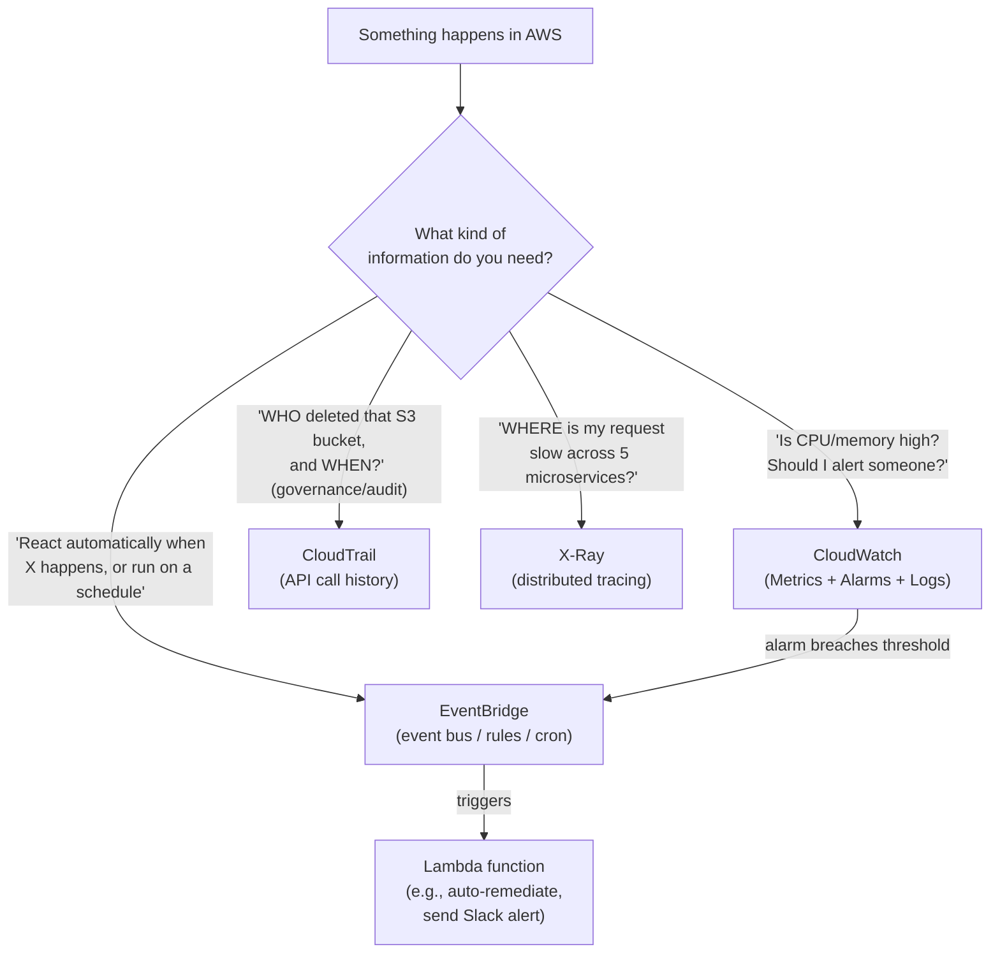
🧠 **One-line memory hook:** *CloudWatch = "how is it performing?" · CloudTrail = "who touched what?" · X-Ray = "where is it slow?" · EventBridge = "then do this automatically."*

📌 **Exam tip:** "Metrics & alarms" → CloudWatch. "Who did what (audit)" → CloudTrail. "Distributed tracing across microservices" → X-Ray. "React to events/schedule tasks" → EventBridge.

---

## Section 15: VPC & Networking

🧠 **Analogy:** VPC = **designing your own private office network topology**, using concepts identical to standard networking you may have touched briefly in Docker/Kubernetes networking.

- **VPC (Virtual Private Cloud)**: your own **isolated private network** in AWS — like your company's internal LAN.
- **Subnet**: a slice of the VPC's IP range tied to one AZ — **Public subnet** (has a route to the internet, hosts your load balancer/web servers) vs **Private subnet** (no direct internet access, hosts your DB/backend — like keeping your DB server off the public internet, only reachable from the app server).
- **Internet Gateway (IGW)**: allows public subnet resources to reach the internet — like your office's internet router.
- **NAT Gateway**: allows **private** subnet resources (e.g., your backend EC2) to reach the internet for outbound calls (e.g., calling an external API or downloading updates) **without** being reachable from the internet — like your office's NAT router that lets employees browse the web but blocks the outside world from initiating connections in.
- **Security Groups vs NACLs**:
    - **Security Group** = stateful, instance-level firewall (like `@PreAuthorize` on a method).
    - **NACL (Network ACL)** = stateless, subnet-level firewall, evaluates rules in order, can explicitly **Deny** (unlike Security Groups which can only Allow) — like a `web.xml` filter chain applied at the network boundary.
- **VPC Flow Logs**: capture network traffic metadata (like a tcpdump log) for auditing/troubleshooting.
- **VPC Peering**: connects two VPCs privately (like connecting two internal company networks via a private tunnel) — non-transitive (A-B and B-C peering doesn't automatically give A-C access).
- **VPC Endpoints**: private connection from your VPC to AWS services (S3, DynamoDB) **without** going over the public internet — like an internal-only service call instead of routing through a public API gateway.
- **Direct Connect & Site-to-Site VPN**: connect your on-premise data center to AWS — Direct Connect = a dedicated private line (like leasing your own fiber line), VPN = an encrypted tunnel over the public internet (cheaper, faster to set up).
- **Transit Gateway**: a central hub connecting many VPCs and on-premise networks — like a network "router of routers" so you don't need a full mesh of peering connections.

### 🔍 Missing but Important: NAT Gateway vs. NAT Instance
Both let a **private subnet** reach the internet outbound-only, but:

| | NAT Gateway (managed) | NAT Instance (old-school, self-managed) |
|---|---|---|
| Who manages it | AWS (fully managed) | You (it's just an EC2 with NAT software) |
| High Availability | Built-in within its AZ (deploy one per AZ for full HA) | You configure it yourself |
| Bandwidth | Scales automatically up to 100 Gbps | Limited by the EC2 instance type you chose |
| Analogy | Like a managed RDS instance — no patching | Like self-hosting your own MySQL on EC2 — full control, full maintenance burden |

📌 **Exam tip:** If the question says "managed, scalable, less operational overhead" → **NAT Gateway** (always the preferred modern answer). NAT Instance is mostly a legacy/trick answer now.

### 🔍 Deep Dive Recap: See the full VPC picture
Scroll back up to the [🗺️ Big Picture diagram](#the-big-picture-a-full-3-tier-app-on-aws) — notice the ALB sits in the **public subnet**, while your EC2 app servers and RDS database sit in **private subnets**, reachable only through the ALB (inbound) and the NAT Gateway (outbound). This exact pattern — "public subnet holds the load balancer, private subnets hold everything else" — is the #1 tested VPC architecture pattern on the exam.

📌 **Exam tip:** Public subnet = web tier (has IGW route). Private subnet = DB/app tier (uses NAT Gateway for outbound-only internet). NACL = subnet-level + stateless + can Deny. Security Group = instance-level + stateful + Allow only.

---

## Section 16: Security & Compliance

🧠 **Analogy:** Think of this as your **security toolbelt**, similar to how you'd combine a WAF, secrets vault, and vulnerability scanner in a real project.

- **WAF (Web Application Firewall)**: filters malicious HTTP requests (SQL injection, XSS) at Layer 7 — like adding input-validation middleware/filters in front of your Spring Boot app, but managed and rule-based, attached to ALB/CloudFront/API Gateway.
- **Shield**: **DDoS protection** — Standard (free, automatic) and Advanced (paid, 24/7 DDoS response team) — like a rate-limiter/circuit breaker protecting your app from being overwhelmed.
- **Network Firewall / Firewall Manager**: manage firewall rules centrally across many VPCs/accounts.
- **KMS (Key Management Service)**: managed encryption key service — like using **Java KeyStore (JKS)**, but AWS manages the keys for you, used to encrypt EBS volumes, S3 objects, RDS databases.

### 🔍 Deep Dive: How KMS Encryption Actually Works (Envelope Encryption)
🧠 **Analogy:** This is exactly like how a **password manager** works — it doesn't encrypt every single password with your master password directly; instead it uses a fast data key for the bulk data, and only your master key encrypts *that* data key.

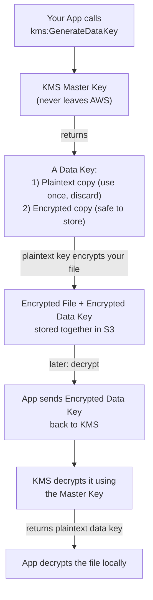
📌 **Exam Fact:** The **master key never leaves KMS** — this is why it's more secure than managing your own `.jks` file that could be copied/stolen. You only ever handle the small, disposable "data key," similar to how a session token is short-lived while the real secret (master key) stays locked away on the server.

### 🔍 Deep Dive: How All the Security Services Fit Together
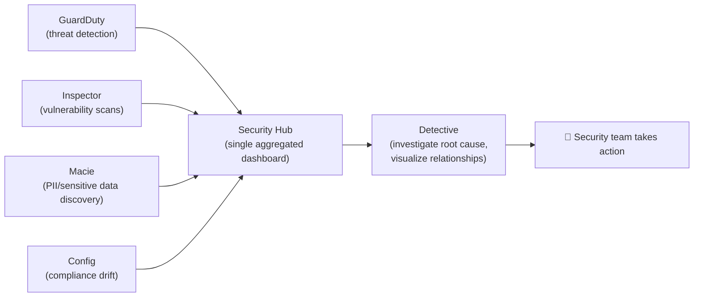
🧠 **Analogy:** Exactly like feeding SonarQube, Snyk, and OWASP Dependency-Check results into **one unified quality dashboard** instead of checking 4 separate tools — Security Hub is your single pane of glass.
- **CloudHSM**: dedicated **Hardware Security Module** — for when you need full control over encryption keys (compliance requirement), like managing your own JKS on dedicated hardware instead of AWS-managed KMS.
- **ACM (AWS Certificate Manager)**: free, managed **SSL/TLS certificates** — like Let's Encrypt, but auto-renewed and integrated directly with ALB/CloudFront (no more manually managing `.pem`/`.jks` files for HTTPS).
- **Secrets Manager**: like **HashiCorp Vault** — stores DB passwords/API keys, supports automatic rotation (better than Parameter Store for secrets requiring rotation).
- **Artifact**: portal for compliance reports/agreements (SOC, PCI-DSS) — like a compliance document repository.
- **GuardDuty**: intelligent **threat detection** using ML — analyzes CloudTrail/VPC Flow Logs/DNS logs to detect suspicious activity (like an intrusion detection system/antivirus for your account).
- **Inspector**: **automated vulnerability scanning** for EC2/ECR images/Lambda — like running `mvn dependency-check` or Snyk/OWASP scans automatically against your infrastructure.
- **Config**: tracks **configuration compliance** over time (e.g., "alert me if any S3 bucket becomes public") — like a Git diff/audit trail for your infrastructure's configuration state.
- **Macie**: uses ML to discover **sensitive data** (PII) in S3 — like a data-loss-prevention scanner.
- **Security Hub**: a **single dashboard** aggregating findings from GuardDuty, Inspector, Macie, Config — like a unified SonarQube dashboard combining multiple code-quality tools' results.
- **Detective**: helps investigate the *root cause* of security findings by visualizing relationships between events.
- **IAM Access Analyzer**: identifies resources shared with external entities (already covered in S3 section too).

📌 **Exam tip:** "Encrypt data with managed keys" → KMS. "Store & auto-rotate secrets" → Secrets Manager. "Free SSL cert for ALB" → ACM. "Detect threats using ML" → GuardDuty. "Scan for vulnerabilities" → Inspector. "Track config compliance" → Config. "Find sensitive/PII data in S3" → Macie. "One dashboard for everything" → Security Hub.

---

## Section 17: Machine Learning

🧠 **Analogy:** Think of these as **pre-built REST APIs for AI tasks** — instead of building/training your own ML model in Java (which is hard), you just call an AWS API endpoint, like calling any third-party SaaS API from your Spring Boot app with `RestTemplate`.

| Service | What it does | Analogy |
|---|---|---|
| **Rekognition** | Image/video analysis (face detection, object recognition) | Like calling a photo-tagging API |
| **Transcribe** | Speech-to-text | Like Google's Speech API |
| **Polly** | Text-to-speech | Like a TTS library |
| **Translate** | Language translation | Like Google Translate API |
| **Lex** | Build chatbots (powers Alexa) | Like Dialogflow |
| **Connect** | Cloud contact center (call center) | Like a virtual call center |
| **Comprehend** | NLP — sentiment analysis, entity extraction | Like an NLP microservice |
| **SageMaker AI** | Build/train/deploy your own custom ML models | Like your own MLOps platform |
| **Kendra** | Intelligent search using NLP | Like an "AI-powered Elasticsearch" |
| **Personalize** | Recommendation engine | Like "customers who bought X also bought Y" |
| **Textract** | Extract text/data from scanned documents | Like OCR + form-parsing API |

📌 **Exam tip:** You don't need deep ML knowledge — just match keywords: "faces/images" → Rekognition, "chatbot" → Lex, "sentiment/text analysis" → Comprehend, "recommendations" → Personalize, "extract text from scanned forms" → Textract.

---

## Section 18: Account Management, Billing & Support

- **AWS Organizations**: manage **multiple AWS accounts** centrally — like a company managing multiple GitHub organizations under one umbrella, with **Consolidated Billing** (one bill for all accounts, combined volume discounts) and **Service Control Policies (SCPs)** (guardrails restricting what member accounts can do — like a company-wide `.gitignore`/policy applied to every repo).
- **Control Tower**: sets up a secure multi-account environment automatically (built on top of Organizations) — like a project scaffolding tool (`spring init`) but for your whole AWS multi-account landing zone.
- **AWS RAM (Resource Access Manager)**: share AWS resources across accounts (e.g., share a VPC subnet) — like sharing a library/module across multiple microservice repos instead of duplicating it.
- **Service Catalog**: lets admins publish approved "templates" of resources for others to self-service deploy — like a shared internal Maven archetype/starter template.
- **Pricing Models**: On-Demand, Reserved, Spot, Savings Plans (already covered in EC2) — same logic applies across other services too.
- **Compute Optimizer**: ML-based recommendations for right-sizing your EC2/Lambda — like a code profiler telling you "you're over-allocating heap memory."
- **Billing & Cost Tools**: Pricing Calculator (estimate costs before building), Cost Explorer (visualize spend trends, like a Grafana dashboard for money), Cost & Usage Report, Billing/Budget Alarms (like a CloudWatch alarm but for **dollars spent**), Cost Anomaly Detection (ML-based unusual spending alerts).
- **Service Quotas**: soft limits per account/region (e.g., max 20 EC2 instances) — like a rate-limit/throttle you can request an increase for.
- **Trusted Advisor**: automated **best-practice checks** across cost, performance, security, fault tolerance — like running a linter/SonarQube scan against your entire AWS account.
- **Support Plans**: Basic (free) → Developer → Business → Enterprise — higher plans = faster response times & a dedicated Technical Account Manager (TAM), like different SLA tiers for a support contract.

### 🔍 Missing but Important Topics
- **AWS Free Tier**: 3 flavors — **Always Free** (e.g., DynamoDB 25GB, Lambda 1M requests/month — forever, like a permanent free plan), **12-Months Free** (e.g., 750 hrs/month of t2.micro EC2 — like a free trial that resets only once, per new account), and **Trials** (short-term free trial for specific services). 📌 Exam trap: Free Tier is **per AWS account**, not per region.
- **Reserved Instance types**: **Standard RI** (biggest discount, but locked to one instance family/type — like a strict annual contract) vs. **Convertible RI** (smaller discount, but lets you change instance family during the term — like a flexible subscription plan you can upgrade).
- **Cost Allocation Tags**: key-value tags (`Team=Backend`, `Env=Prod`) attached to resources so Cost Explorer can break down spend by team/project — like adding `@Component("teamBackend")` labels so you can filter logs/metrics by team in Grafana.
- **AWS Budgets**: proactively set a $ threshold and get alerted **before** you overspend — different from Billing Alarms (which react to CloudWatch metrics reactively); Budgets can even auto-trigger an action (like stopping non-prod EC2 instances) when exceeded.

📌 **Exam tip:** "One bill, many accounts, volume discount" → Consolidated Billing. "Automated best practice checks" → Trusted Advisor. "Estimate cost before building" → Pricing Calculator. "Analyze historical spend" → Cost Explorer.

---

## Section 19: Advanced Identity

- **STS (Security Token Service)**: issues **short-lived temporary credentials** — like generating a short-lived JWT access token instead of a permanent API key; used for cross-account access or federated identity ("AssumeRole").
- **Cognito**: manages **sign-up/sign-in for your own web/mobile app's end users** (not AWS console users!) — like using **Auth0/Keycloak** for your application's user authentication, supports social logins (Google/Facebook) and issues JWT tokens your Spring Boot backend can validate.
- **Directory Service**: managed **Microsoft Active Directory** in AWS — for integrating with existing enterprise directories (like an LDAP server your company already uses).
- **IAM Identity Center** (formerly AWS SSO): **single sign-on** across multiple AWS accounts and business apps — like using one Okta/SSO login instead of separate credentials for every account.

📌 **Exam tip:** "Authenticate your app's end customers" → Cognito. "Authenticate AWS console/CLI users across accounts" → IAM Identity Center. "Temporary cross-account credentials" → STS.

---

## Section 20: Other Services

Quick-recognition list (exam just needs you to match the keyword):
- **WorkSpaces**: managed **virtual desktops** (VDI) — like remote-desktop-as-a-service.
- **AppStream 2.0**: streams a specific **desktop application** to a browser (not a full desktop).
- **IoT Core**: connects/manages IoT devices at scale.
- **AWS Backup**: centralized, automated backup service across EC2/EBS/RDS/DynamoDB/EFS — like a single cron job managing all your backups instead of writing custom scripts per service.
- **Disaster Recovery Strategies**: 4 strategies by increasing cost/decreasing recovery time — **Backup & Restore** (cheapest, slowest) → **Pilot Light** (minimal standby) → **Warm Standby** (scaled-down running copy) → **Multi-Site Active-Active** (full duplicate, fastest, most expensive) — like choosing between "restore from a backup tape" vs. "have a hot failover server always running."
- **AWS Elastic Disaster Recovery (DRS)**: replicates your on-prem/cloud servers for fast recovery.
- **Cloud Migration — the 7 Rs**: Retire, Retain, Relocate, Rehost ("lift & shift" — move as-is), Replatform ("lift, tinker & shift"), Repurchase (switch to a SaaS, e.g., migrate from your own CRM to Salesforce), Refactor/Re-architect (rebuild cloud-native, e.g., break a monolith into microservices — biggest effort, biggest long-term payoff).
- **Application Discovery Service / Migration Evaluator / Migration Hub**: tools to plan and track a migration project.
- **Step Functions**: **visual workflow orchestration** for chaining Lambda functions/services together — like a **state machine / BPMN workflow engine** (e.g., Camunda) for coordinating multi-step business processes (e.g., order → payment → shipping, with retries and error handling built in).
- **Ground Station**: satellite communication as a service (niche).
- **Fault Injection Simulator (FIS)**: **chaos engineering** — like Netflix's Chaos Monkey, intentionally breaks things to test resilience.

---

## Section 21: AWS Architecting & Ecosystem

### AWS Well-Architected Framework — 6 Pillars
🧠 **Analogy:** Think of this as **AWS's version of clean-code/SOLID principles**, but for infrastructure architecture.
1. **Operational Excellence**: run and monitor systems to deliver business value (like having good CI/CD + monitoring/logging practices).
2. **Security**: protect data/systems (least privilege, defense in depth — like input validation + encryption + IAM).
3. **Reliability**: recover from failures, scale to meet demand (like designing for retries/circuit breakers/failover, no single point of failure).
4. **Performance Efficiency**: use resources efficiently, adapt as needs change (right-sizing, caching — like using the right data structure/algorithm for the job).
5. **Cost Optimization**: avoid unnecessary costs (like avoiding over-provisioned Reserved Instances or a memory leak wasting resources).
6. **Sustainability**: minimize environmental impact.

- **AWS Well-Architected Tool**: free self-assessment tool checking your architecture against the 6 pillars — like running a code review checklist against your infra.
- **Cloud Adoption Framework (CAF)**: guides organizations (not just tech) on business, people, governance, platform, security, and operations perspectives for successful cloud adoption.
- **AWS Knowledge Center / Managed Services**: support resources; **Managed Services (AMS)** = AWS operates your infrastructure for you (like hiring a managed DevOps team).

---

## Section 22-23: Exam Prep & Final Cheat Sheet

### Quick-Match Cheat Sheet (memorize this table!)

| If the question mentions... | Think... |
|---|---|
| Managed, patched relational DB | **RDS/Aurora** |
| NoSQL, serverless, key-value at scale | **DynamoDB** |
| Object/file storage, static website | **S3** |
| Virtual server, full OS control | **EC2** |
| Serverless function, pay-per-execution | **Lambda** |
| Containers without managing servers | **Fargate** |
| CDN / cache static content globally | **CloudFront** |
| DNS routing | **Route 53** |
| Message queue, decouple services | **SQS** |
| Pub/sub, broadcast events | **SNS** |
| Real-time data streaming | **Kinesis** |
| Metrics + alarms | **CloudWatch** |
| Audit log of API calls | **CloudTrail** |
| Distributed tracing | **X-Ray** |
| Infrastructure as Code | **CloudFormation** |
| Encrypt data with keys | **KMS** |
| Store/rotate secrets | **Secrets Manager** |
| Free SSL certs | **ACM** |
| ML-based threat detection | **GuardDuty** |
| Vulnerability scanning | **Inspector** |
| Config compliance tracking | **AWS Config** |
| Find PII/sensitive data | **Macie** |
| One security dashboard | **Security Hub** |
| Authenticate app's end users | **Cognito** |
| SSO across AWS accounts | **IAM Identity Center** |
| Temporary credentials | **STS** |
| Multi-account billing | **Organizations** |
| Best practice checks | **Trusted Advisor** |
| Private network in AWS | **VPC** |
| Firewall at instance level (stateful) | **Security Group** |
| Firewall at subnet level (stateless, can deny) | **NACL** |
| Private subnet outbound internet | **NAT Gateway** |
| Connect on-prem to AWS (dedicated line) | **Direct Connect** |

### Exam Logistics
- **CLF-C02**: 65 questions, 90 minutes, scored 100-1000, passing score **700**.
- Question types: multiple choice (1 correct) and multiple response (2+ correct).
- No coding, no hands-on labs — purely conceptual/service-matching questions.
- You can **flag questions** for review and come back later — do this liberally.
- **Eliminate obviously wrong answers first** — most questions have 1-2 clearly incorrect options.
- Read for **keywords**: "cheapest," "fastest," "most secure," "least operational overhead," "serverless," "managed" — these words point directly to the right service.
- Get an extra 30 minutes if English isn't your native language (mentioned in the course — request via AWS certification portal).

### 🔍 Missing but Important: Exam Domain Weightage (study time budget)
Spend your revision time **proportionally** to how the real exam is weighted — don't over-study Machine Learning (a tiny footnote) while under-studying Security (a third of the exam!):

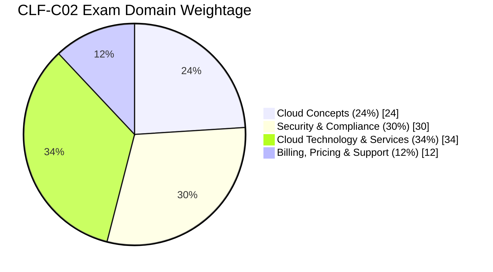

| Domain | Weight | Guide Sections to Focus On |
|---|---|---|
| **Domain 1: Cloud Concepts** | 24% | Sections 3, 21 (cloud value prop, deployment/service models, Well-Architected) |
| **Domain 2: Security & Compliance** | 30% | Sections 4, 16, 19 (IAM, Shared Responsibility, KMS, GuardDuty, Cognito, STS) |
| **Domain 3: Cloud Technology & Services** | 34% | Sections 5-15, 17, 20 (EC2, S3, DBs, networking, compute, integration, monitoring) |
| **Domain 4: Billing, Pricing & Support** | 12% | Section 18 (pricing models, Free Tier, Trusted Advisor, support plans) |

📌 **Biggest exam surprise for most people:** **Security is nearly 1/3rd of the exam** — yet many learners rush through IAM. Re-read Section 4 and 16 twice before your exam date.

### Your Personal Study Plan (as a Java Full-Stack Dev)
1. Map every AWS service to something you already know (this guide did that — review it 2-3 times).
2. Do all **hands-on labs** in the course (Console tour, IAM, EC2, S3) — muscle memory beats memorization.
3. Take all **Quizzes 1-20** in the course — they mirror real exam style.
4. Take the **Practice Exam** at the end (Section 22) — review every wrong answer's explanation.
5. Before the real exam, skim this cheat sheet one final time.

---

## 🏢 Real Company Examples (Who Uses What)

Grounding each service in a real production use case makes it stick far better than the definition alone. Here's how well-known companies actually use these services in the real world:

| Company / Scenario | AWS Services Used | Why |
|---|---|---|
| **Netflix** | S3 (video assets), CloudFront (global streaming CDN), EC2 + Auto Scaling, DynamoDB (viewing history), Chaos Monkey/FIS (resilience testing) | Needs to stream video globally at massive scale with zero downtime — famous for pioneering chaos engineering on AWS |
| **A large e-commerce site (Black Friday)** | ALB + Auto Scaling Groups (absorb traffic spikes), RDS Read Replicas + ElastiCache (reduce DB load), CloudFront (cache product images), SQS (decouple order processing from checkout) | Unpredictable, massive short-term traffic spikes need elastic, decoupled architecture |
| **A bank / regulated fintech** | IAM + MFA + SCPs (strict access control), KMS/CloudHSM (encryption compliance), CloudTrail + Config (audit trail for regulators), Direct Connect/VPN (hybrid — core ledger stays on-prem, analytics in AWS) | Heavy compliance & audit requirements, some workloads legally must stay on-prem (hybrid cloud) |
| **A startup building an MVP** | Lambda + API Gateway + DynamoDB (fully serverless, near-zero idle cost), Cognito (auth), Amplify/S3 (frontend hosting) | Minimize operational overhead and cost while pre-product-market-fit; scales automatically if the product takes off |
| **A healthcare provider** | Private/Hybrid Cloud, encrypted S3/RDS (PHI data), Macie (detect PII), strict IAM least-privilege | PHI (Protected Health Information) compliance (HIPAA) requires strict data residency and access control |
| **A media company doing nightly batch reporting** | AWS Batch or Lambda (ETL jobs), Redshift (data warehouse), Athena (ad-hoc SQL on S3 data lake), QuickSight (dashboards) | Classic OLAP/analytics pipeline — separate from the OLTP production database |
| **A global SaaS company** | Route 53 (latency-based routing), multi-region Aurora Global Database, S3 Cross-Region Replication, CloudFront | Needs low latency for users worldwide with disaster recovery across regions |

---

## 💬 Top Interview Questions & Answers

Beyond the multiple-choice exam, these are the conceptual questions you'll likely face in a technical interview once you're AWS-certified:

**Q1: What is the difference between an IAM User and an IAM Role?**
> A: An IAM User has **long-term** credentials (password/access keys) meant for a human or a specific application identity. An IAM Role provides **temporary** credentials assumed by a user, service, or application (e.g., an EC2 instance or Lambda function) — no long-term keys are stored, which is far more secure. Always prefer roles for anything running *inside* AWS.

**Q2: When would you use a Security Group vs. a Network ACL?**
> A: Security Groups are **stateful** and operate at the **instance** level (return traffic is automatically allowed) — use them as your primary, fine-grained firewall per resource. NACLs are **stateless** and operate at the **subnet** level, evaluated in rule-number order, and can explicitly **Deny** — use them as a coarse, defense-in-depth layer (e.g., blocking a known-malicious IP range for an entire subnet).

**Q3: Explain Multi-AZ vs. Read Replica in RDS.**
> A: Multi-AZ is for **high availability/disaster recovery** — a synchronous standby copy in another AZ that's *not* queryable and only used for automatic failover. A Read Replica is for **read scaling/performance** — an asynchronous copy that *is* queryable and can even be promoted to a standalone primary.

**Q4: Why would you choose DynamoDB over RDS for a new project?**
> A: When the workload needs virtually unlimited horizontal scale, single-digit-millisecond latency at any scale, a flexible (schema-less) data model, and you don't need complex joins/transactions across many tables. RDS is preferred when you need strong relational integrity, complex queries/joins, and your team is comfortable with SQL/JPA-style modeling.

**Q5: How does IAM decide whether to Allow or Deny a request?**
> A: It evaluates all applicable policies (identity-based, resource-based, SCPs, permission boundaries). **Any explicit Deny wins immediately.** If no explicit Deny exists, it checks for an explicit Allow. If neither exists, the request is **denied by default** (implicit deny).

**Q6: What's the real difference between horizontal and vertical scaling, and which does AWS favor?**
> A: Vertical scaling = making a single instance bigger (more vCPU/RAM) — has a hard ceiling and requires downtime to resize. Horizontal scaling = adding more instances behind a load balancer — AWS's Auto Scaling Groups favor this because it has no practical ceiling and improves fault tolerance (no single point of failure).

**Q7: Why is Lambda considered "serverless," and what's a cold start?**
> A: "Serverless" means you never provision or manage the underlying server — AWS handles capacity, patching, and scaling transparently, and you pay only for actual execution time (billed per millisecond). A "cold start" is the extra latency incurred when AWS must spin up a brand-new execution environment (load the runtime + your code) because no warm one is available — Java/JVM-based Lambdas typically have higher cold-start latency than Python/Node due to JVM class-loading overhead.

**Q8: What's the Shared Responsibility Model, in one sentence?**
> A: AWS secures the cloud (physical data centers, hardware, host virtualization, global network); you secure what you put **in** the cloud (data, IAM configuration, OS patches on EC2, network/firewall rules, application-level security) — and the split shifts further toward AWS as you move up the stack from IaaS (EC2) to PaaS to fully managed serverless services.

**Q9: How would you design a fault-tolerant, cost-efficient web app on AWS from scratch?**
> A: Route 53 for DNS → CloudFront for static asset caching → an ALB spreading traffic across an Auto Scaling Group of EC2 instances (or Fargate containers) in **at least 2 AZs**, in **private subnets** → RDS with Multi-AZ for the database, plus Read Replicas if read-heavy → ElastiCache in front of the DB for hot data → SQS/SNS to decouple slow/background work → CloudWatch + CloudTrail for monitoring and audit → S3 for static/user-uploaded files, using lifecycle rules to move cold data to Glacier for cost savings.

**Q10: What's the difference between SQS, SNS, and Kinesis, and how would you pick one?**
> A: SQS = point-to-point queue (one message, one consumer processes it) — for decoupling a producer from a slower/independent consumer. SNS = pub/sub (one message, many subscribers) — for broadcasting an event to multiple independent systems. Kinesis = high-throughput, ordered, real-time **streaming** data (many producers/consumers, replayable) — for use cases like clickstream analytics or log aggregation where order and scale matter more than simple decoupling.

---

## 🧩 Memory Mnemonics Vault

Quick mental hooks to recall groups of concepts under exam pressure:

| Mnemonic | Stands For | Use It To Remember... |
|---|---|---|
| **PEA** | **P**rovision, **E**lasticity, **A**utomation | The core essence of what "cloud computing" gives you over traditional IT |
| **SCALE** | **S**peed, **C**ost, **A**gility, **L**ocation, **E**fficiency | The 5 benefits of cloud computing (Section 3) |
| **RUPP** | **R**oot, **U**ser, **P**olicy, **R**ole (a P for Policy too) | The 4 core IAM entities (Section 4) |
| **RAPID** | **R**egions, **A**vailability zones, **P**oints of presence, **I**nfrastructure, **D**istribution | AWS Global Infrastructure building blocks (Section 3/12) |
| **LASER** | **L**east-privilege, **A**udit (CloudTrail), **S**ecure (MFA), **E**ncrypt, **R**otate keys | The 5 IAM/security best practices you should apply everywhere (Section 4/16) |
| *"Deny > Allow > Default Deny"* | — | The exact order IAM evaluates every request (Section 4) |
| *"Multi-AZ = Survive, Read Replica = Scale"* | — | Never confuse these two RDS features again (Section 9) |
| *"CW = How, CT = Who, XR = Where, EB = Then"* | CloudWatch / CloudTrail / X-Ray / EventBridge | The 4 monitoring services and what question each answers (Section 14) |

---

## 📝 20 Practice Exam Questions (with Answers)

Test yourself — cover the answers below and see how many you get right on the first pass.

1. Which AWS service is fully serverless with zero server management? **(A)** EC2 **(B)** Lambda **(C)** RDS **(D)** EBS
2. Where do you enable MFA for extra account security? **(A)** EC2 **(B)** IAM **(C)** S3 **(D)** CloudTrail
3. Which storage type is object storage, not block or file storage? **(A)** EBS **(B)** EFS **(C)** S3 **(D)** RDS
4. Which service resolves domain names to IP addresses? **(A)** CloudFront **(B)** Route 53 **(C)** API Gateway **(D)** ELB
5. Which storage class is cheapest for long-term archival, accepting hours of retrieval time? **(A)** S3 Standard **(B)** Glacier Deep Archive **(C)** EBS **(D)** S3 One Zone-IA
6. An EC2 instance needs to write to S3 without hardcoded credentials — what should you attach? **(A)** An IAM User **(B)** An IAM Role **(C)** A root access key **(D)** A bucket policy only
7. Which RDS feature is for automatic failover / high availability (not read scaling)? **(A)** Read Replica **(B)** Multi-AZ **(C)** Aurora Serverless **(D)** DynamoDB Global Tables
8. Which firewall is stateful and operates at the instance level? **(A)** NACL **(B)** Security Group **(C)** WAF **(D)** Shield
9. Which service lets a private subnet's EC2 instance reach the internet outbound-only? **(A)** Internet Gateway **(B)** NAT Gateway **(C)** VPC Peering **(D)** Direct Connect
10. Which service provides an audit trail of every API call made in your account? **(A)** CloudWatch **(B)** CloudTrail **(C)** Config **(D)** Trusted Advisor
11. Which pricing model is cheapest but can be interrupted with a 2-minute warning? **(A)** On-Demand **(B)** Reserved Instance **(C)** Spot Instance **(D)** Savings Plan
12. What best describes the Shared Responsibility Model for EC2? **(A)** AWS manages everything **(B)** You manage everything **(C)** AWS manages the hardware/hypervisor, you manage the guest OS and above **(D)** Responsibility is split 50/50 always
13. Which service is a managed key-value/document NoSQL database with single-digit millisecond latency? **(A)** RDS **(B)** DynamoDB **(C)** Redshift **(D)** Neptune
14. Which service would you use to decouple a producer and consumer with point-to-point message delivery? **(A)** SNS **(B)** SQS **(C)** Kinesis **(D)** EventBridge
15. Which tool gives automated best-practice checks across cost, security, performance, and fault tolerance? **(A)** Cost Explorer **(B)** Trusted Advisor **(C)** AWS Budgets **(D)** Compute Optimizer
16. Which AWS service lets you run Docker containers without managing any EC2 servers? **(A)** ECS on EC2 **(B)** Fargate **(C)** Lightsail **(D)** EKS with self-managed nodes
17. What is the correct definition of an Availability Zone? **(A)** A country where AWS operates **(B)** One or more discrete data centers with redundant power/networking within a Region **(C)** A CDN caching point **(D)** A single physical server
18. Which service issues short-lived, temporary security credentials? **(A)** IAM Access Analyzer **(B)** STS **(C)** Secrets Manager **(D)** Cognito
19. Which AWS Organizations feature lets you restrict what actions member accounts can perform, account-wide? **(A)** IAM Policy **(B)** Service Control Policy (SCP) **(C)** Bucket Policy **(D)** Permission Boundary
20. Which of the 6 Well-Architected pillars focuses specifically on minimizing environmental impact? **(A)** Operational Excellence **(B)** Reliability **(C)** Sustainability **(D)** Cost Optimization

<details>
<summary>📖 Click to reveal answers</summary>

1-B, 2-B, 3-C, 4-B, 5-B, 6-B, 7-B, 8-B, 9-B, 10-B, 11-C, 12-C, 13-B, 14-B, 15-B, 16-B, 17-B, 18-B, 19-B, 20-C

</details>

**Good luck — you've got this! 🚀**

